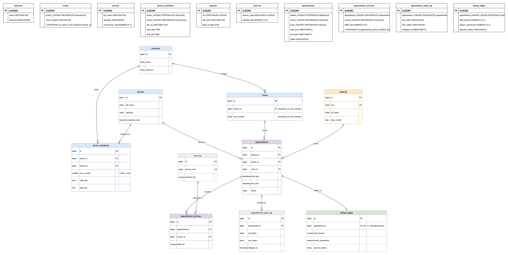

Here is the updated `README.md` configured to match your exact database name (`clinic_ops_db`) and your workspace file names (`1_init_db.sql`, `2_schema.sql`, `3_trigger.sql`, `seed_data.py`, `4_analytices.sql`, `ClincERD.png`):

```markdown
# Multi-Branch Clinic Appointment & Financial Settlement Ledger

A production-grade relational database engine designed for multi-branch outpatient healthcare networks. Built with **MySQL 8.0+**, this system eliminates double-booking race conditions at the database level, logs append-only audit histories, and enforces an immutable double-entry financial settlement ledger across 50,000+ realistic clinical transactions.

---

## 📌 Executive Summary & Problem Statement

Outpatient medical practices frequently suffer from operational fragmentation and revenue leakage due to brittle database implementations:
1. **Double-Booking & Room Collisions:** Relying solely on client-side application code to prevent schedule overlap causes race conditions during high-concurrency bookings.
2. **Untracked Schedule Modifications:** Front-desk re-bookings and cancellations often overwrite existing records, leaving zero historical trace for compliance or dispute resolution.
3. **Disjointed Doctor Settlements:** Clinics struggle to accurately reconcile complex doctor commission rates against out-of-pocket patient co-pays, insurance receivables, and no-show penalties.

**Solution:** This architecture pushes critical integrity guarantees directly into the database engine using transactional triggers, composite indexes, strict relational normalization (3NF), and an immutable financial settlement ledger.

---

## 🏗️ Relational Architecture & ERD

The schema models 10 distinct entities spanning **Clinic Infrastructure**, **Clinical Care & Catalog**, **Operational Appointments**, and **Financial Auditing**.


```

[branches] 1──< [rooms] 1──< [appointments] >──1 [patients]
│                              │     │
1                              │     └──1 [billing_ledger] (1:1)
└──< [doctor_schedules] >──1   │
│  │
[doctors]
│
[services] 1──< [appointment_services]
│
[appointments] 1──< [appointment_audit_log]

```

### Entity-Relationship Diagram



### Key Architectural Highlights:
* **Anti-Collision Guard:** State-checked `BEFORE INSERT/UPDATE` triggers calculate temporal overlap via `(start_time < NEW.end_time AND end_time > NEW.start_time)` across doctors and rooms simultaneously, returning custom `SQLSTATE 45000` exceptions on conflict.
* **1-to-1 Financial Reconciliation:** The `billing_ledger` table enforces `UNIQUE(appointment_id)`, ensuring exact balance settlement per visit while dividing clinic margins and doctor commission cuts.
* **Append-Only Audit Trail:** An automated `AFTER UPDATE` trigger intercepts status transitions and schedule shifts, persisting `OLD` vs `NEW` states, timestamps, and active database users without requiring backend intervention.

---

## ⚡ Scale & Synthetic Data Generation

The database is populated with an enterprise test suite generated via Python (`Faker` + `mysql-connector-python`):

| Entity | Volume | Description |
| :--- | :--- | :--- |
| **Branches & Examination Rooms** | 3 Branches / 12 Rooms | Multi-location setup with specialized units. |
| **Practicing Doctors** | 12 Providers | Covers 7 medical specialties with tier-based commissions. |
| **Registered Patients** | 5,000 Records | Unique MRNs with full demographic profiles. |
| **Historical Appointments** | **50,000+ Records** | 300 days of shift-aligned 30-minute booking windows. |
| **Services Rendered** | 75,000+ Records | Procedure mappings with historical billing snapshots. |
| **Financial Ledger Entries** | 40,000+ Settlements | Split into patient paid, insurance claims, and provider cuts. |

---

## 📊 Analytical Insights & Showcase Queries

The database provides turnkey executive reporting through optimized analytical SQL:

### 1. Doctor Utilization & Revenue Scorecard
Evaluates provider clinical hours, completion percentages, and generated gross billings vs net commission payouts.

```sql
SELECT 
    d.id AS doctor_id,
    d.full_name AS doctor_name,
    d.specialty,
    COUNT(a.id) AS total_appointments_booked,
    SUM(CASE WHEN a.status = 'completed' THEN 1 ELSE 0 END) AS completed_visits,
    ROUND(100.0 * SUM(CASE WHEN a.status = 'completed' THEN 1 ELSE 0 END) / COUNT(a.id), 2) AS completion_rate_pct,
    ROUND(SUM(CASE WHEN a.status = 'completed' THEN 0.5 ELSE 0 END), 1) AS billable_clinical_hours,
    COALESCE(SUM(bl.total_amount), 0.00) AS total_gross_billed,
    COALESCE(SUM(bl.doctor_commission), 0.00) AS total_doctor_commission
FROM doctors d
LEFT JOIN appointments a ON d.id = a.doctor_id
LEFT JOIN billing_ledger bl ON a.id = bl.appointment_id
GROUP BY d.id, d.full_name, d.specialty
ORDER BY total_gross_billed DESC;

```

### 2. Monthly Financial Margin Breakdown

Aggregates patient copays, outstanding insurance receivables, and net clinic overhead retention.

```sql
SELECT 
    DATE_FORMAT(a.start_time, '%Y-%m') AS billing_month,
    COUNT(DISTINCT a.id) AS total_billed_appointments,
    SUM(bl.total_amount) AS gross_revenue,
    SUM(bl.patient_paid) AS patient_copays_collected,
    SUM(bl.insurance_paid) AS insurance_claims_billed,
    SUM(bl.clinic_cut) AS net_clinic_overhead_retained,
    SUM(bl.doctor_commission) AS doctor_payouts_due,
    ROUND(100.0 * SUM(bl.clinic_cut) / SUM(bl.total_amount), 2) AS clinic_profit_margin_pct
FROM appointments a
JOIN billing_ledger bl ON a.id = bl.appointment_id
WHERE a.status IN ('completed', 'no_show')
GROUP BY DATE_FORMAT(a.start_time, '%Y-%m')
ORDER BY billing_month DESC;

```

### 3. Patient Non-Attendance Risk by Branch & Day of Week

Pinpoints operational drop-off trends to optimize front-desk SMS reminders and staff allocations.

```sql
SELECT 
    b.name AS branch_name,
    DAYNAME(a.start_time) AS day_of_week,
    COUNT(a.id) AS total_scheduled,
    SUM(CASE WHEN a.status = 'no_show' THEN 1 ELSE 0 END) AS no_shows,
    SUM(CASE WHEN a.status = 'cancelled' THEN 1 ELSE 0 END) AS cancellations,
    ROUND(
        100.0 * (
            SUM(CASE WHEN a.status = 'no_show' THEN 1 ELSE 0 END) + 
            SUM(CASE WHEN a.status = 'cancelled' THEN 1 ELSE 0 END)
        ) / COUNT(a.id), 
        2
    ) AS non_attendance_rate_pct
FROM appointments a
JOIN rooms r ON a.room_id = r.id
JOIN branches b ON r.branch_id = b.id
GROUP BY b.name, DAYNAME(a.start_time), DAYOFWEEK(a.start_time)
ORDER BY b.name, DAYOFWEEK(a.start_time);

```

---

## 🚀 Quickstart & Reproduction

### 1. Database Initialization & Schema

Execute the setup, schema, and trigger scripts in your MySQL client:

```bash
mysql -u root -p < 1_init_db.sql
mysql -u root -p clinic_ops_db < 2_schema.sql
mysql -u root -p clinic_ops_db < 3_trigger.sql

```

### 2. Seed Synthetic Dataset

Install dependencies and run the batch insertion script:

```bash
pip install mysql-connector-python faker
python seed_data.py

```

### 3. Run Analytics

Run the business reporting suite:

```bash
mysql -u root -p clinic_ops_db < 4_analytices.sql

```

---

## 📁 Repository Structure

```text
.
├── 1_init_db.sql        # Database initialization (clinic_ops_db)
├── 2_schema.sql         # Table definitions, constraints, and B-tree indexes
├── 3_trigger.sql        # Anti-collision and audit trail triggers
├── 4_analytices.sql     # Executive KPIs and reporting queries
├── ClincERD.drawio      # Editable draw.io diagram file
├── ClincERD.png         # Exported ERD image for documentation
├── seed_data.py         # Batch generator for 50k+ records
└── README.md            # Project documentation and architecture guide

```

---

## 🛠️ Tech Stack & Concepts Demonstrated

* **RDBMS:** MySQL 8.0+ (InnoDB Engine)
* **Database:** `clinic_ops_db`
* **Design Patterns:** Third Normal Form (3NF), Temporal Interval Locking, Append-Only Audit Logging, Double-Entry Settlement
* **Optimization:** Composite B-Tree Indexing (`doctor_id`, `start_time`, `end_time`), Query Profiling via `EXPLAIN`
* **Tooling:** Python (Data Ingestion), Faker, draw.io (ERD Modeling)

```

*(Note: In your folder, export `ClincERD.drawio` as `ClincERD.png` so the image renders properly in the preview)[cite: 5].*

```
